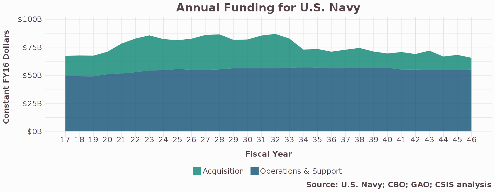
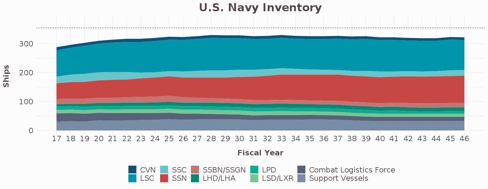

# navy-1
Each year, the Navy releases its 30-year shipbuilding plan. This document separates Navy ships into nine categories (CVN, LSC, SSC, SSN, SSGN, SSBN, AWS, CLF, and support vessels). For each of the categories, the Navy projects how many ships it will procure and how many ships it will have in its inventory each year. The plan does not include acquisition costs or operations and support (O&S) costs for each category. However, acquisition and O&S cost data is available elsewhere.   

This app adopts the structure of the 30-year shipbuilding plan and integrates Navy budget data. Each of the Navy's ship categories displays an independent slider that allows the user to adjust the quantity of that category. [Amphibious warfare ships are separated into three categories (LHD/LHA, LPD, and LSD/LXR); SSGN and SSBN are consolidated into one category]   

Slider default: each slider is set to the number of ships the Navy plans to have in its inventory by 2046. Any increase to a slider will build ships as early as possible and any decrease will cancel the earliest planned procurements.   

Slider max: the user can only increase the slider to the degree that shipyard capacity allows. Shipyard capacity is the estimated number of ships that can be built each year for each category.

Slider min: while the user can cancel planned procurements, the user cannot decommission existing ships.   

The Trump administration's ambitious plan to reach a 355-ship Navy coupled with a lack of specifics to achieve this plan has led to a wide range of recommendations for how the Navy's shipbuilding plan should change. However, these recommendations have a similarly wide range of budgetary assumptions behind them, which are often difficult to understand.   

The purpose of this app is to create a transparent and interpretable analytic model of the Navy's force structure that is easy to use. The model accounts for the key factors that all recommendations should consider: the Navy's current procurement plan, its current inventory plan, unit acquisition cost, unit O&S cost, and capacity constraints.   

There are, of course, factors that this model does not account for (such as the ability to change shipyard capacity, to develop entirely new ship classes, and to account for economies of scale or research and development costs). We have examined these challenges in subsequent research.   

